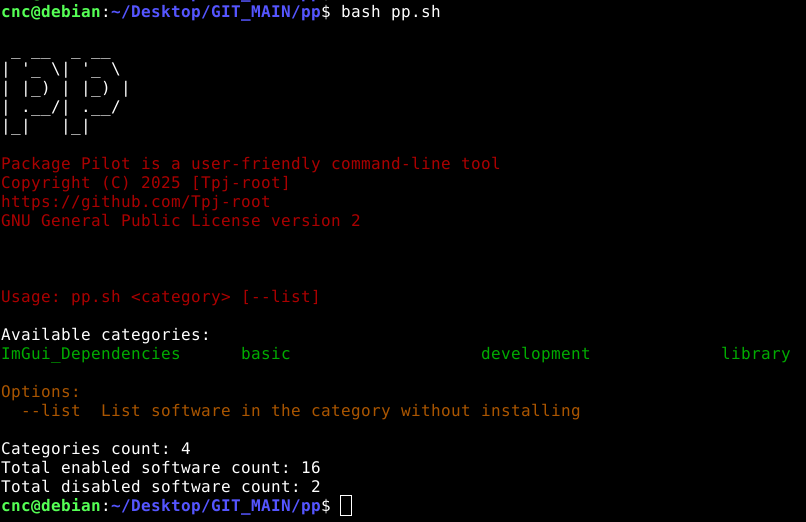

# pp
Package_Pilot


### Description:

Package Pilot is a powerful, user-friendly command-line tool designed to simplify software installation on Linux systems.

It uses a JSON configuration file to categorize and manage software packages, allowing you to install or list software with ease. 

With features like enable/disable flags and colorful output, Package Pilot makes managing dependencies and software setups a breeze.


### How It Works


 - JSON Configuration:
 
 
Package Pilot reads a basic_software.json file that organizes software into categories (e.g., basic, development, library). Each software entry includes a description and an enable flag (1 for enabled, 0 for disabled).
 
 - Category-Based Installation:
 
You can install or list software by specifying a category (e.g., basic or development). The tool checks the enable flag to determine whether to install or skip a package.
 
 - Colorful Output:
 
 When listing software, Package Pilot uses colors to highlight enabled (green) and disabled (red) packages, making it easy to identify which software will be installed.
 
 
 
 
Example Commands:


./pp.sh basic


### Check if the JSON file is valid

```
jq . yourfile.json

```





### To-Do List:

    [] Add .json input file arguments.
    [] Add and edit the JSON file via the terminal.
    [] dpkg -l into json
    
    
